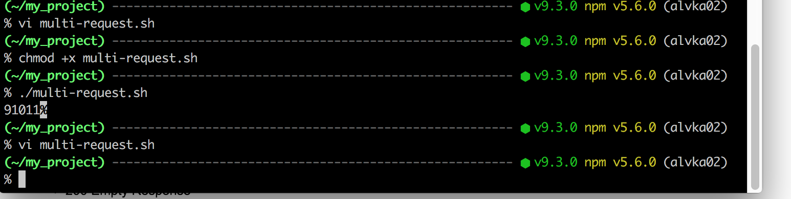

**Name of product:**

	Password Hashing Application

**Prepared by:**

**	**

	Karla Alves

**Objectives:**

**	**To make sure the end result meets the requirement specifications.

**Environment:**

	

	Mac OS X - El Captain

**Test Cases:**

As an user of the Password Hashing Application I want to see the correct response when creating a password with special characters

    1. Steps:

        1. Enter the following curl command: 

            1. curl -X POST -H "application/json" -d '{"password":"angrymonkey!@#$%^&*"}' *[http://127.0.0.1:8088/has*h](http://127.0.0.1:8088/hash)

            2. Expected Result is a successful request 

    2. Test Case Result - post to the hash endpoint was successful

	

* * *

As an user of the Password Hashing Application I want to see the correct response when creating a password with one single character

    1. Steps:

        1. Enter the following curl command: 

            1. curl -X POST -H "application/json" -d '{"password":"a"}' *[http://127.0.0.1:8088/has*h](http://127.0.0.1:8088/hash)

            2. Expected Result is a successful request 

      b.  Test Case Result - post to the hash endpoint was successful

* * *

As an user of the Password Hashing Application I want to see the correct response when creating a password with space

1. Steps:

        2. Enter the following curl command: 

            3. curl -X POST -H "application/json" -d '{"password":"angry monkey!@#$%^&*"}' *[http://127.0.0.1:8088/has*h](http://127.0.0.1:8088/hash)

            4. Expected Result is a successful request 

      b.  Test Case Result - post to the hash endpoint was successful

* * *

As an user of the Password Hashing Application I want to verify if the hashing algorithm is SHA512

    1. Steps:

        1. Enter the following curl command:

            1. curl -X POST -H "application/json" -d '{"password":"angrymonkey"}' *[http://127.0.0.1:8088/has*h](http://127.0.0.1:8088/hash)

            2. curl -X POST -H "application/json" -d '{"password":"angrymonkey"}' *[http://127.0.0.1:8088/has*h](http://127.0.0.1:8088/hash)/#   or go to *[http://127.0.0.1:8088/has*h](http://127.0.0.1:8088/hash)/# to obtain the hash value

            3. echo ‘echo "hash #’ base64 --decode’

            4. Expected result:  Hashing algorithm is SHA512

    2. Test Case Result - Not what was expected.

		

* * *

As an user of the Password Hashing Application I want to verify that creating same password gives same hash

    1. Steps:

        1. Enter the following curl command:

            1. curl -X POST -H "application/json" -d '{"password":"angrymonkey"}' *[http://127.0.0.1:8088/has*h](http://127.0.0.1:8088/hash)/1

            2. curl -X POST -H "application/json" -d '{"password":"angrymonkey"}' *[http://127.0.0.1:8088/has*h](http://127.0.0.1:8088/hash)/2

            3. Expected result: Hash will match

    2. Test Case Result - Hash matched

* * *

As an user of the Password Hashing Application I want to verify that shutdown the application works as expected

    1. Steps:

        1. Enter the following curl command:

            1.  curl -X POST -d ‘shutdown’ *[http://127.0.0.1:8088/has*h](http://127.0.0.1:8088/hash)

            2. Expected result : Shutdown would happen

    2. Test Case Result: Got the ‘Malformed Input’ message back

* * *

As an user of the Password Hashing Application I want to see the correct response when creating a password with all uppercase letters

    1. Steps:

        1. Enter the following curl command:

            1. curl -X POST -H "application/json" -d '{"password":"ANGRYMONKEY"}' *[http://127.0.0.1:8088/has*h](http://127.0.0.1:8088/hash)

            2. Expected Result:  successful request

        2. Test Case Result: post to the hash endpoint was successful

     

* * *

		 

As an user of the Password Hashing Application I want to see the correct response when creating a password with all uppercase letters and numbers.

    2. Steps:

        3. Enter the following curl command:

            3. curl -X POST -H "application/json" -d '{"password":"ANGRYMONKEY123"}' *[http://127.0.0.1:8088/has*h](http://127.0.0.1:8088/hash)

            4. Expected Result:  successful request

        4. Test Case Result: post to the hash endpoint was successful

* * *

As an user of the Password Hashing Application I want to see the correct response when creating a      password with first letter as uppercase, lowercase letters and numbers.

    3. Steps:

        5. Enter the following curl command:

            5. curl -X POST -H "application/json" -d '{"password":"Angrymonkey123"}' *[http://127.0.0.1:8088/has*h](http://127.0.0.1:8088/hash)

            6. Expected Result:  successful request

        6. Test Case Result: post to the hash endpoint was successful

	

* * *

As an user of the Password Hashing Application I want to issue multiple requests to create passwords.

    4. Steps:

        7. Enter the following curl command multiple times on a script :

            7. curl -X POST -H "application/json" -d '{"password":"angrymonkey"}' *[http://127.0.0.1:8088/has*h](http://127.0.0.1:8088/hash)

            8. Run the script

            9. Expected Result:  successful request

        8. Test Case Result: post to the hash endpoint was successful

* * *

As an user of the Password Hashing Application I want to see the correct response when creating a      password with only special characters.

    5. Steps:

        9. Enter the following curl command:

            10. curl -X POST -H "application/json" -d '{"password":"!@#$%^&*()_+=-"}' *[http://127.0.0.1:8088/has*h](http://127.0.0.1:8088/hash)

            11. Expected Result:  successful request

        10. Test Case Result: post to the hash endpoint was successful

* * *

As an user of the Password Hashing Application I want to see the correct response when creating a      password beginning with an underscore character.

    6. Steps:

        11. Enter the following curl command:

            12. curl -X POST -H "application/json" -d '{"password":"_123456"}' *[http://127.0.0.1:8088/has*h](http://127.0.0.1:8088/hash)

            13. Expected Result:  successful request

        12. Test Case Result: post to the hash endpoint was successful

* * *

As an user of the Password Hashing Application I want to see the correct response when creating a      password with an empty string.

    7. Steps:

        13. Enter the following curl command:

            14. curl -X POST -H "application/json" -d '{"password":" "}' *[http://127.0.0.1:8088/has*h](http://127.0.0.1:8088/hash)

            15. Expected Result:  successful request

        14. Test Case Result: post to the hash endpoint was successful

* * *

As an user of the Password Hashing Application I want to see the correct response when creating a very long password.

    8. Steps:

        15. Enter the following curl command:

            16. curl -X POST -H "application/json" -d '{"password":"angrymonkeyangrymonkeyangrymonkeyangrymonkeyangrymonkeyangrymonkeyangrymonkeyangrymonkeyangrymonkeyangrymonkeyangrymonkeyangrymonkeyangrymonkeyangrymonkeyangrymonkeyangrymonkeyangrymonkeyangrymonkeyangrymonkeyangrymonkeyangrymonkeyangrymonkeyangrymonkeyangrymonkeyangrymonkeyangrymonkeyangrymonkey"}' *[http://127.0.0.1:8088/has*h](http://127.0.0.1:8088/hash)

            17. Expected Result:  successful request

        16. Test Case Result: post to the hash endpoint was successful

* * *

As an user of the Password Hashing Application I want to verify that different passwords generate different hashes.

    9. Steps:

        17. Enter the following curl command:

            18. curl -X POST -H "application/json" -d '{"password":"angrymonkey"}' *[http://127.0.0.1:8088/has*h](http://127.0.0.1:8088/hash)

            19. Expected Result:  successful request

        18. Test Case Result: post to the hash endpoint was successful

	

* * *

As an user of the Password Hashing Application I want to see the correct response when creating a        password with a single number.

    10. Steps:

        19. Enter the following curl command:

            20. curl -X POST -H "application/json" -d '{"password":"1"}' *[http://127.0.0.1:8088/has*h](http://127.0.0.1:8088/hash)

            21. Expected Result:  successful request

        20. Test Case Result: post to the hash endpoint was successful

	

* * *

As an user of the Password Hashing Application I want to see the correct response when creating a        password that starts and ends with an underscore character.

    11. Steps:

        21. Enter the following curl command:

            22. curl -X POST -H "application/json" -d '{"password":"_angrymonkey_"}' *[http://127.0.0.1:8088/has*h](http://127.0.0.1:8088/hash)

            23. Expected Result:  successful request

        22. Test Case Result: post to the hash endpoint was successful

	

	

* * *

As an user of the Password Hashing Application I want to see the correct response when creating a        password that begin with a space.

    12. Steps:

        23. Enter the following curl command:

            24. curl -X POST -H "application/json" -d '{"password":" angrymonkey"}' *[http://127.0.0.1:8088/has*h](http://127.0.0.1:8088/hash)

            25. Expected Result:  successful request

        24. Test Case Result: post to the hash endpoint was successful

	

* * *

As an user of the Password Hashing Application I want to see the correct response when creating a        password that end with a space.

    13. Steps:

        25. Enter the following curl command:

            26. curl -X POST -H "application/json" -d '{"password":"angrymonkey "}' *[http://127.0.0.1:8088/has*h](http://127.0.0.1:8088/hash)

            27. Expected Result:  successful request

        26. Test Case Result: post to the hash endpoint was successful

	

* * *

As an user of the Password Hashing Application I want to see the correct response when creating a        password with alternating lower and uppercase letters.

    14. Steps:

        27. Enter the following curl command:

            28. curl -X POST -H "application/json" -d '{"password":" aNgRyMoNkEy"}' *[http://127.0.0.1:8088/has*h](http://127.0.0.1:8088/hash)

            29. Expected Result:  successful request

        28. Test Case Result: post to the hash endpoint was successful

* * *

	

